# ISAP2 — HANDOFF

> Актуальность контекста: 15 июля 2026 года, после сессии диагностики (093dafa)
> Назначение: передача проекта в новый чат или другому ИИ-разработчику без потери контекста.  
> Язык работы и пользовательского интерфейса: русский.

## 1. Кратко о проекте

**ISAP2** — система подготовки документов в области промышленной безопасности. Текущий основной фокус — модуль формирования **ПМЛА** (плана мероприятий по локализации и ликвидации последствий аварий) для опасных производственных объектов.

Система должна:

- собирать сведения об организации и ОПО через анкету;
- импортировать данные из DOCX;
- находить или предлагать организацию и ОПО для привязки;
- сохранять проверенную анкету;
- преобразовывать данные в контекст ПМЛА v2;
- генерировать редактируемый DOCX по шаблону;
- конвертировать DOCX в PDF;
- выполнять автоматическую проверку качества;
- оставлять итоговый документ пригодным для ручной проверки специалистом.

Главная цель текущего этапа — не расширение архитектуры, а **полноценная и воспроизводимая генерация одного корректного ПМЛА v2 на реальных данных**.

## 2. Репозиторий и рабочее окружение

- GitHub: `dreamszzzgm-netizen/ISAP2`
- Основная ветка: `main`
- Актуальный локальный корень на компьютере пользователя: `D:\Project ISAP\isap`
- Ранее использовался путь `D:\Git Hub\ISAP2`; он считается устаревшим.
- По ранее переданному контексту backend и frontend могут находиться во вложенном каталоге:
  - `D:\Project ISAP\isap\isap\backend`
  - `D:\Project ISAP\isap\isap\frontend`

Перед любой работой обязательно определить фактическую структуру репозитория. Не менять файлы, основываясь только на путях из этого документа.

### Первый безопасный контроль

```powershell
Set-Location "D:\Project ISAP\isap"
git status --short
git branch --show-current
git log -5 --oneline
git remote -v
Get-ChildItem
docker compose config --services
```

Затем найти ключевые файлы и сверить реальное состояние с этим HANDOFF. Если код расходится с описанием ниже, приоритет всегда у текущего репозитория.

## 3. Предпочтительный режим работы

Пользователь предпочитает три режима:

1. **Основной режим** — короткий, точный промпт для ИИ-разработчика, который работает с локальным репозиторием.
2. **Контрольный режим** — пользователь присылает отчёт, логи, `git diff`, результаты тестов и `git status`; ассистент проверяет их и даёт следующий шаг.
3. **Аварийный режим** — при необходимости готовится точечный patch или ZIP с исправлением.

Дополнительные правила:

- не усложнять архитектуру без необходимости;
- двигаться небольшими проверяемыми этапами;
- сначала диагностировать причину, затем исправлять;
- не смешивать в одном этапе массовый рефакторинг, изменение шаблона и исправление данных;
- давать готовые PowerShell-команды, когда пользователю нужно выполнить их локально;
- при большой делимой задаче использовать применимые skills, MCP и субагентов;
- перед коммитом показывать результаты тестов, `git diff --stat` и `git status`;
- не выполнять push без явного указания пользователя.

### 3.1. Протокол использования skills

Skills являются частью рабочего процесса, а не необязательным украшением отчёта.

Перед началом этапа исполнитель должен:

1. проверить `AGENTS.md`, `.agents/`, `.codex/` и список доступных skills;
2. выбрать только skills, соответствующие текущей задаче;
3. прочитать инструкции выбранного skill до выполнения действий;
4. явно учитывать ограничения skill в плане и итоговой проверке;
5. не объявлять skill использованным, если была прочитана только его документация.

Наиболее вероятные направления применения:

| Задача | Подходящий skill или класс skills |
|---|---|
| GitHub, PR, review, CI | GitHub skills; отдельные workflows для review comments и failing CI |
| Проверка DOCX | document-rendering/document inspection skills |
| Проверка PDF | PDF render, extraction и visual QA skills |
| Таблицы справочников служб | spreadsheet skills |
| Изображение титульного листа | image generation/editing skill |
| Актуальная техническая документация | docs/research skill с первичными источниками |
| Долговременный handoff и артефакты | file/library skill, если он доступен |

Если в репозитории есть собственные project skills, они должны быть перечислены с путями и назначением после фактической проверки. Не переносить в отчёт названия неустановленных или недоступных skills.

### 3.2. Протокол использования MCP

MCP следует использовать для получения проверяемого контекста и работы с подключёнными системами, когда соответствующий сервер действительно настроен и доступен.

Перед использованием:

1. найти конфигурацию MCP в репозитории и рабочем окружении;
2. перечислить доступные серверы, tools, resources и resource templates;
3. выполнить безопасный read-only вызов для проверки соединения;
4. зафиксировать, какой MCP-сервер был источником данных;
5. не считать наличие конфигурации доказательством работающего подключения.

Предпочтительные области:

- GitHub — состояние репозитория, PR, issues и CI;
- документация — актуальные спецификации и первичные источники;
- внешние справочники — только если подключён подтверждённый источник;
- Knowledge Graph/RAG — если проект действительно предоставляет соответствующий MCP-сервер;
- файловые источники — если пользователь явно предоставил или подключил их.

Ограничения:

- MCP не заменяет локальные unit/integration/E2E тесты;
- write-операции, публикация, отправка сообщений и изменение удалённых данных требуют отдельного подтверждения цели;
- секреты MCP нельзя записывать в репозиторий, логи и HANDOFF;
- если MCP недоступен, использовать локальный fallback и явно указать это в отчёте.

### 3.3. Протокол работы субагентов

Для крупной проверки ПМЛА предпочтительна схема: **один основной агент + до трёх субагентов**.

| Исполнитель | Независимая зона ответственности |
|---|---|
| Основной агент | План, распределение задач, сверка выводов, интеграция изменений и финальный отчёт |
| Субагент 1 | Import, API, preview, сохранение, привязка организации и ОПО |
| Субагент 2 | Generation context, v2 mapper, schema, Rules/Scenario, KG/RAG |
| Субагент 3 | Шаблон, плейсхолдеры, DOCX/PDF, visual QA и Quality Review |

Правила:

- делегировать только независимые и чётко ограниченные задачи;
- сначала поручать read-only аудит, если ещё не определена причина дефекта;
- не разрешать двум агентам одновременно редактировать один файл;
- каждый субагент возвращает факты, пути, тесты, риски и рекомендуемый patch;
- основной агент проверяет выводы и отвечает за окончательные изменения;
- после параллельной работы обязательно запускать общий набор тестов;
- не использовать субагентов ради формальности для одной небольшой правки.

### 3.4. Graphiti/Graphify harness

Упомянутый пользователем **Graphiti/Graphify harness** необходимо включать в технический handoff, если он является частью контура Knowledge Graph/RAG или тестовой инфраструктуры.

На момент подготовки этой версии точное имя, путь и реализация harness не подтверждены. Поиск по удалённому репозиторию не вернул совпадений `graphiti`, `graphify`, `harness` или `mcp`; это не доказывает отсутствие компонента, потому что индексирование или доступ к содержимому репозитория могут быть неполными.

Первичная локальная проверка:

```powershell
Set-Location "D:\Project ISAP\isap"
rg -n -i "graphiti|graphify|graphifi|harness|knowledge.?graph|mcp" .
rg --files | rg -i "graph|rag|harness|mcp|eval"
```

Если harness найден, в HANDOFF нужно зафиксировать:

- точное название и путь;
- назначение и связь с Knowledge Graph Adapter/RAG Adapter;
- способ запуска;
- требуемые env-переменные и внешние сервисы без значений секретов;
- fixtures/seed data;
- режим in-memory fallback;
- набор eval-сценариев;
- ожидаемый отчёт и пороги успешности;
- используется ли он в CI или запускается вручную.

Минимальные проверки harness для ПМЛА:

- одинаковый запрос воспроизводимо возвращает ожидаемые сущности;
- данные разных типов ОПО не смешиваются;
- сеть газопотребления, котельная и АГЗС получают собственные hazards/scenarios/services/appendices/regulations;
- fallback проверяется отдельно от внешнего graph backend;
- недоступность графа не приводит к скрытой подстановке неверных данных;
- provenance показывает, использован граф или fallback;
- результаты можно сохранить как диагностический артефакт E2E.

Статус блокера зависит от роли компонента:

- если Graphiti/Graphify является production-источником KG, рабочий harness — блокер полноценной KG-backed приёмки;
- если текущий MVP официально использует in-memory fallback, harness не блокирует первый DOCX/PDF пилот, но обязателен до включения внешнего графа в production.

## 4. Технологический стек

- Backend: Python, FastAPI.
- Frontend: Next.js.
- Тесты backend: `pytest`.
- Контейнеризация: Docker Compose.
- DOCX: шаблонный рендеринг `pmla_v2_template.docx`.
- PDF: конвертация через LibreOffice.
- Данные и метаданные: в проекте используется JSON/JSONB; конкретную СУБД уточнить по `docker-compose.yml` и конфигурации.
- В `docker-compose.yml` ранее добавлялся mount `./files:/files`.

## 5. Основной конвейер ПМЛА v2

Ожидаемая последовательность:

1. Пользователь создаёт или импортирует анкету.
2. Импорт выполняет preview без немедленной записи.
3. Формируются `organization_candidate` и `facility_candidate`.
4. Пользователь подтверждает или исправляет привязку.
5. Анкета сохраняется с организацией и ОПО.
6. `build_generation_context` формирует исходный контекст.
7. `map_to_v2_context` преобразует его в структуру ПМЛА v2.
8. Контекст проверяется по `pmla_v2.schema.json`.
9. `PmlaTemplateRenderer` заполняет `pmla_v2_template.docx`.
10. DOCX конвертируется в PDF через LibreOffice.
11. Quality Review формирует замечания и итоговый статус.
12. Специалист выполняет содержательную и визуальную проверку.

Frontend должен передавать:

```json
{
  "template_version": "v2"
}
```

В provenance ранее ожидались:

```json
{
  "template_version": "v2",
  "pipeline": "pmla_template_renderer"
}
```

## 6. Ключевые файлы

Фактическое наличие и пути необходимо проверить в репозитории.

- `backend/src/api/routers/pmla_questionnaires.py`
  - API анкет ПМЛА;
  - валидация `template_version`;
  - импорт, preview и привязка.
- `backend/src/application/services/pmla_generation_from_questionnaire_service.py`
  - запуск генерации из анкеты;
  - отдельный v2 pipeline.
- `backend/src/application/services/pmla_v2_context_mapper.py`
  - преобразование анкеты и generation context в v2 context;
  - fallback и валидация.
- `backend/src/application/services/pmla_quality_review_service.py`
  - автоматическая проверка качества документа.
- `backend/tests/integration/test_pmla_v2_integration.py`
  - интеграционные проверки v2.
- `files/pmla_v2.schema.json`
  - схема контекста ПМЛА v2.
- `files/pmla_v2_template.docx`
  - основной шаблон DOCX;
  - ранее сообщался размер около 12,5 МБ, 13 media-объектов и собственные стили.
- `docker-compose.yml`
  - сервисы и подключение каталога `/files`.
- `docs/PMLA_MVP_FINAL_SUMMARY.md`
- `docs/PMLA_MVP_RELEASE_CANDIDATE.md`
- `docs/PROGRESS.md`

## 7. Поддерживаемые типы ОПО

Ранее проверялись:

- сеть газопотребления;
- котельная;
- АГЗС — станция газозаправочная (автомобильная).

Требование пользователя: не использовать старое сокращённое название «АЗС» вместо «АГЗС» в этом контексте.

Для каждого типа должны быть изолированы:

- оборудование;
- опасности;
- сценарии;
- обязательные службы;
- приложения;
- нормативные документы;
- запрещённые термины и тексты от других типов ОПО.

Первым реальным пилотом следует оставить **сеть газопотребления**, поскольку этот тип изучен лучше остальных.

## 8. Подтверждённое состояние

По отчётам предыдущих этапов и подтверждено текущей диагностикой (15.07.2026):

- Assembly Layer и DOCX runtime реализованы.
- Исправлялись стили заголовков, оглавление, поля PAGE и состав приложений.
- Реализован Quality Review v2 с data- и block-aware проверками.
- Реализованы Knowledge Graph Adapter и RAG Adapter с in-memory fallback.
- RAG используется ограниченно в RulesEngine, ScenarioEngine и NarrativeEngine.
- Реализован конвейер анкеты v2 от frontend до генератора.
- Backend принимает `template_version: "v2"`.
- DOCX создаётся из `pmla_v2_template.docx`.
- PDF создаётся через LibreOffice.
- В ранее проверенном документе не было raw Markdown, mojibake и полного текста анкеты.
- `pmla_v2.schema.json` был смягчён: количество обязательных полей уменьшено, `additionalProperties` разрешены.
- Реализован review workflow документа со статусами от `draft` до `archived`.
- Все 8 ключевых файлов из раздела 6 существуют (с префиксом `isap/`).

### Текущее состояние тестов (15.07.2026)

**779 passed, 3 skipped, 0 failed** (после исправления SyntaxError и `person` fixture).

Все 8 падавших тестов `test_pmla_v2_schema_alignment.py` (audit_only) исправлены добавлением `person` в тестовый fixture.

**Docker:** 4 контейнера запущены (backend, frontend, db, chromadb).

### Текущая ветка и коммиты

**Ветка:** `patch-c/pmla-pasf-frontend-hardening`
**Новые коммиты за сессию:**
```
093dafa test(pmla): add missing 'person' key to _build_full_context fixture
e8f3538 feat(pmla): separate financial_reserve_insurance from insurance; split attachments_checklist from PASF attachments; None-safe facility_type in scenario engine
5de3d32 fix(smart-import): resolve unterminated f-string SyntaxError blocking test suite
```

### Блокеры для тестов (исправлены)

1. **SyntaxError** в `smart_import/service.py:330` — unterminated f-string. Исправлен и закоммичен.
2. **`person` undefined** в `_build_full_context()` — отсутствовал ключ `person` в тестовом fixture. Исправлен и закоммичен.

## 9. Последний выполненный этап: диагностика и подготовка к пилоту (15.07.2026)

Завершена диагностическая сессия. Выполнено:

1. **Проверена структура репозитория** — Git-корень `D:/Project ISAP/isap`, код во вложенном `isap/`.
2. **Сверены ключевые файлы** — все 8 из раздела 6 существуют.
3. **Запущены тесты** — Docker работает; после исправлений: 779 passed, 3 skipped, 0 failed.
4. **Проверены skills и MCP** — 5 project skills в `.agents/`, 6 Claude skills, MCP сервер `graphify` в `isap/.mcp.json`.
5. **Найден Graphify harness** — AST-анализ кода, не KG. Graphiti не найден.
6. **Определены расхождения HANDOFF vs реальность** — вложенный путь, размер шаблона, SyntaxError.
7. **Исправлены 2 блокера:** SyntaxError в `smart_import/service.py` + `person` в тестовом fixture.
8. **Выявлен разрыв между шаблоном и маппером:** незакоммиченный `pmla_v2_template.docx` — это полностью переработанный документ (удалены табличные циклы, добавлены плоские переменные).
9. **Составлена таблица маппинга** всех 45+ переменных шаблона к source_context.

### 9.1. Сессия продолжения (15.07.2026) — OOXML flat renderer и пилот

Продолжена работа предыдущего агента по задаче «Create OOXML flat renderer
preserving all graphics / Remove external links / Generate new pilot DOCX /
Run minimal checks». Фактический результат:

- **OOXML flat renderer уже существовал** (`backend/src/application/services/pmla_ooxml_flat_renderer.py`, untracked) и корректно сохраняет графику (побайтовое копирование нетекстовых частей пакета + lxml-сериализация text-частей с сохранением namespace-префиксов, без `doc.save()`). Он **не был подключён** к v2-пайплайну (тот всё ещё использует `PmlaTemplateRenderer`, портящий `r:embed`).
- **Исправлены 2 бага рендерера:**
  1. Split-плейсхолдеры: шаблон разбивает `{{` на два run (`{`+`{`), поэтому per-run скан `{{` не срабатывал и теги оставались. Переписана flat-замена на сканирование конкатенированного буфера всех `w:t` с отслеживанием владельца символа (`_replace_flat_robust`).
  2. Dotted context token `{{ person.position }}` ранее оставался незаменённым — добавлен nested-dict резолв из сырого контекста.
- **External links:** в `pmla_v2_template.docx` внешних ссылок **0** (проверено: нет `TargetMode="External"`, LINK/INCLUDEPICTURE/INCLUDETEXT/DDEAUTO, внешних `Target`, `attachedTemplate`). Рендерер при этом скрабит их на лету.
- **Сгенерирован новый пилотный DOCX** через flat renderer:
  - `files/pmla_v2_rendered_test.docx` (6 616 889 байт) + PDF (4 880 273 байт);
  - пустой вариант `files/pmla_v2_rendered_empty.docx/.pdf`.
- Скрипт `backend/scripts/full_render_and_pdf.py` переключён на `PmlaOoxmlFlatRenderer`; добавлен `person` в mock-контекст и авто-заполнение недостающих плейсхолдеров.

**Проверки (факты):**
- 0 незаменённых тегов `{{ }}`/`` во всех text-частях итогового DOCX (проверено программно по распакованному пакету).
- Графика сохранена: 14/14 media-частей byte-for-byte равны шаблону; все `r:embed`/`r:id` разрешаются; 0 malformed XML.
- Loop `equipment_list` раскрыт корректно (Table 5 = заголовок + 3 строки данных с `loop.index` + итог).
- `{{ person.position }}` → «Генеральный директор».
- Тесты пайплайна: `52 passed, 10 skipped, 0 failed` (schema alignment + v2 integration).

**Известные ограничения после сессии:**
- Flat renderer **не подключён** к production-пайплайну (`pmla_generation_service.py`, `pmla_generation_from_questionnaire_service.py` вызывают `PmlaTemplateRenderer`). Подключение — отдельная задача, требует решения пользователя.
- В рендер-логе виден warning «Unreplaced template tokens» — **false positive** в safety-net агрегации (соседние `}}` от склейки run); на диске тегов нет. Можно зачистить отдельным патчем.
- Пилот на mock-контексте; реальный import-пилот ещё не выполнен (нет эталонного комплекта — блокер из раздела 11).

### Незакоммиченные изменения (не трогались в этой сессии)

```
 M isap/files/pmla_v2_template.docx           — полностью переработанный шаблон
 M isap/frontend/next-env.d.ts                — техническое обновление
 M isap/frontend/.../pmla-questionnaire-page.tsx — UX-улучшения (русские подписи)
?? isap/HANDOFF.md, AGENTS.md, AI_DEVELOPER_PROMPT.md — новые сопроводительные
?? isap/backend/scripts/agents/ и ~30 файлов  — скрипты и docs
?? isap/docs/audit/ ~15 файлов                — аудиты
?? isap/backend/tests/test_pmla_v2_single_placeholders.py — новый тест
```

### 9.2. Сессия D1–D4 (16.07.2026) — thread-safety, валидация dotted, тесты, provenance

Диагностика из 4 субагентов подтвердила: оба production-сервиса уже используют
`PmlaOoxmlFlatRenderer`, 0 потерянных OOXML-частей, графика сохранена. Найдены
4 дефекта; по согласованию с пользователем внесены минимальные точечные правки
(без возврата к `PmlaTemplateRenderer`, без изменения `pmla_v2_template.docx`):

- **D2 (thread-safety):** удалён shared mutable state
  `PmlaOoxmlFlatRenderer._resolve_flat._raw_context` и `self._loop_lists`.
  `loop_lists` и `raw_context` теперь передаются локально через всю цепочку
  `render → _render_text_part → _expand_table_row_loops / _replace_flat_placeholders
  → _replace_flat_robust → _resolve_flat`. Параллельные `render()` на одном
  инстансе больше не смешивают контексты (проверено тестом 10×3 потоков).
- **D3 (валидация dotted):** `_extract_flat_placeholders` теперь включает
  dotted-токены (`person.position`), но исключает loop-переменные (`eq.*`,
  `loop.index`). Добавлен helper `_dotted_path_served` + `_extract_loop_variables`.
  Валидация в `render()` различает scalar и dotted-плейсхолдеры.
- **D4 (provenance/docstrings):** `generation_pipeline` в обоих сервисах
  обновлён с `"pmla_template_renderer"` на `"pmla_ooxml_flat_renderer"`;
  docstrings и модульный docstring mapper'а приведены в соответствие.
- **D1 (тесты):** новый файл `backend/tests/test_pmla_ooxml_flat_renderer.py`
  (23 теста + 1 xfail). Покрытие: basic render, ZIP integrity, no leftover
  Jinja tags, все flat-плейсхолдеры заменены, dotted-резолв, loop expansion,
  byte-for-byte media preservation (14/14), validation errors, concurrency
  (10×3 потоков без смешивания), детерминизм, render_to_file, factory,
  UnsupportedTemplateError. Прошёл независимый ревью субагента с учётом
  замечаний (усилен concurrency-тест, убран false-confidence assert, добавлены
  sanity-проверки размера extraction).

**Проверки (факты):**
- Полный backend test suite: **800 passed, 10 skipped, 1 xfailed, 0 failed**.
- Runtime E2E через `map_to_v2_context → PmlaOoxmlFlatRenderer`: ZIP OK (33 части),
  14/14 media byte-идентичны шаблону, 0 незаменённых `{{`/`{%}`,
  `organization_full_name` доходит до DOCX.
- `template_version: "v2"` и `generation_pipeline: "pmla_ooxml_flat_renderer"`
  фиксируются в `generation_meta` обоих сервисов.

**Обновлённый граф цепочки генерации:**

```dot
digraph PMLA_v2_Pipeline {
    rankdir=LR;
    node [shape=box, style=rounded];

    Questionnaire  [label="Анкета/DOCX\n(PmlaQuestionnaireService)", shape=cylinder];
    DBContext      [label="Database Context\n(build_context)", shape=cylinder];
    GenContext     [label="Generation Context (nested dict)"];
    V2Mapper       [label="map_to_v2_context()\npmla_v2_context_mapper.py", fillcolor="#E8F0FE", style=filled];
    Validate       [label="validate_v2_context()\n(jsonschema)", shape=diamond];
    FlatRenderer   [label="PmlaOoxmlFlatRenderer\nzipfile + lxml, байт-в-байт копия\nNO shared state (D2)\ndotted validation (D3)\n[АКТИВЕН, тесты D1]", fillcolor="#C6EFCE", style=filled];
    Template       [label="pmla_v2_template.docx\nfiles/", shape=folder];
    DOCX           [label="Output DOCX (bytes)\ngeneration_pipeline=\npmla_ooxml_flat_renderer (D4)", shape=note];

    Questionnaire -> GenContext;
    DBContext     -> GenContext;
    GenContext    -> V2Mapper;
    V2Mapper      -> Validate;
    Validate      -> FlatRenderer [label="v2_context"];
    FlatRenderer  -> Template [label="ZIP copy + lxml"];
    Template      -> FlatRenderer [label="read"];
    FlatRenderer  -> DOCX;
}
```



**Известные ограничения после сессии:**
- `_fill_loop_row` имеет существующий баг: при пустом `equipment_list`
  split-run `` маркеры не очищаются полностью (зафиксировано
  `xfail(strict=True)`; не связано с D2, требует отдельной правки).
- `_resolve_flat` применяет `_xml_escape`, а lxml повторно экранирует при
  сериализации → двойное экранирование спецсимволов в значениях (косметический
  баг, существовал до D2, вне объёма задачи).
- `PmlaTemplateRenderer` остаётся мёртвым кодом, на который ссылаются тесты
  schema-alignment/integration (60+ тестов). Их миграция на flat renderer —
  отдельная задача.

## 10. Текущая цель

Получить один воспроизводимый приёмочный комплект на реальных данных:

1. исходная анкета DOCX;
2. import preview;
3. подтверждённая организация и ОПО;
4. сохранённая анкета JSON;
5. generation context JSON;
6. v2 context JSON;
7. DOCX;
8. PDF;
9. отчёт Quality Review;
10. таблица сверки исходных и сгенерированных значений;
11. журнал дефектов;
12. результат повторной генерации после исправлений.

## 11. Главные оставшиеся блокеры

### Критические для реального пилота

- Нет зафиксированного эталонного комплекта реальных данных для одного ОПО.
- Не завершён сквозной E2E сценарий импорта, привязки и генерации.
- Не подтверждён полный маппинг `анкета → context → v2 context → DOCX`.
- Не зафиксирована окончательная версия шаблона и реестр плейсхолдеров.
- Не выполнена полная постраничная проверка актуального DOCX и PDF.
- Не определён формальный ожидаемый результат для каждого обязательного поля.
- Не проведена итоговая ручная экспертиза содержания ПМЛА на реальном объекте.

### Известные дефекты (диагностированы, не исправлены)

- **Незакоммиченный шаблон** `files/pmla_v2_template.docx` — полная переработка (committed версия — старый шаблон с циклами). Рабочий шаблон использует ~45 плоских переменных вместо ~75 с циклами.
- **`development_year`** — добавлен в незакоммиченный шаблон, но не формируется `map_to_v2_context()` и отсутствует в схеме. Производственный pipeline через `enhanced_generator` добавляет `year`, но v2 pipeline (напрямую через маппер) — нет.
- **`insurance_amount`** — в маппере (строка 801) читается только из legacy `material_reserve.insurance_amount`. Современное `opo_insurance_amount` не используется как fallback.
- **`director_position`, `director_full_name`, `fire_department_name/short_name/address`, `hospital_name`, `financial_reserve_order_*`, `contractor_director_position`, `contractor_dispatch_address`, `edds_name`, `opo_insurance_*`** — добавлены в шаблон, маппер их производит (кроме `contractor_director_position` — проверить).
- **Пропущенные в тестовом fixture `_build_full_context()`:** `development_year`, `insurance_amount`, `director_position`, `director_full_name`, `director_phone`, `fire_department_*`, `hospital_name`, `financial_reserve_*`, `contractor_director_*`, `contractor_dispatch_address`, `edds_name`, `opo_insurance_*`. Они уже есть в маппере, но не в fixture.
- **Файл `pmla_v2.schema.json` не синхронизирован** с незакоммиченным шаблоном — не содержит новых полей (`development_year`, `person`, `director_position`, `fire_department_name` и др.), но содержит устаревшие (EquipmentDefect).
- **Проектные скрипты** (`backend/scripts/agents/`, `fix_headers_*.py`, `visual_qa_deep.py` и др.) — не добавлены в Git, пылятся в рабочем дереве.

### Не должны блокировать первый пилот

- полный справочник ПАСФ;
- автоматический выбор ближайшей пожарной части, скорой, полиции и газовой службы;
- автоматические рекомендации по силам и средствам;
- массовый импорт разных вариантов DOCX;
- расширение KG/RAG для всех возможных типов ОПО;
- косметическая редактура всех narrative-блоков.

Если эти сведения можно внести вручную для одного объекта, первый пилот следует продолжать.

## 12. Шаблон и плейсхолдеры

Пользователь отдельно запрашивал следующие поля:

- полное наименование организации;
- сокращённое наименование организации;
- должность руководителя;
- ФИО руководителя;
- должность и ФИО должны быть разными плейсхолдерами;
- наименование пожарной части;
- сокращённое наименование пожарной части;
- номер договора АСФ;
- дата договора АСФ;
- 2–3 должности и ФИО ответственных в организации;
- 2–3 должности и ФИО ответственных на ОПО;
- ЕДДС;
- местная администрация;
- подразделение МЧС;
- территориальный орган Ростехнадзора.

Перед реальным тестом нужен машинно и вручную проверяемый реестр:

| Плейсхолдер | Источник данных | Пример | Раздел DOCX | Обязательность |
|---|---|---|---|---|

Необходимо проверить, что плейсхолдеры не разбиты на несколько Word runs и что один тег не используется для разных смыслов.

## 13. Данные и справочники

Пользователь планирует или предлагал:

- справочник ПАСФ: организация, контакты, свидетельства, оснащение, паспорт и договор;
- справочник пожарной охраны;
- справочники скорой помощи, полиции, газовой службы и ЕДДС;
- подбор ближайшей службы по адресу ОПО;
- ручной выбор, если автоматический результат неоднозначен;
- рекомендации по силам и средствам организации;
- умный импорт DOCX.

Для первого пилота допустимо ручное заполнение справочных данных. Не следует строить все справочники до проверки базовой генерации.

## 14. Проверки качества, которые уже важны

Quality Review ранее включал или должен учитывать:

- `emergency_service_phones`;
- `notification_responsible`;
- `financial_reserve_data`;
- `insurance_data`;
- `familiarization_date`;
- `appendix_signatures`;
- обязательную службу из Knowledge Graph;
- обязательный сценарий;
- обязательное приложение;
- применимые нормативные документы.

Для допуска документа к ручной приёмке ожидается:

- 0 критических ошибок;
- каждое предупреждение либо исправлено, либо имеет понятное обоснование;
- нет данных от другого объекта или другого типа ОПО;
- нет выдуманных реквизитов и контактов.

## 15. Порядок следующего реального теста

### Этап A. Зафиксировать входные данные

- выбрать одну сеть газопотребления;
- собрать карточку организации и ОПО;
- собрать оборудование, ответственных, договор АСФ и службы;
- подготовить эталонную таблицу «поле — ожидаемое значение — место в документе»;
- сделать обезличенную копию для будущих автотестов.

### Этап B. Проверить импорт без генерации

- загрузить реальный DOCX;
- получить preview;
- проверить распознанные и нераспознанные поля;
- проверить кандидатов организации и ОПО;
- убедиться, что неоднозначность не приводит к автоматической ошибочной привязке.

### Этап C. Проверить сохранение и привязку

- подтвердить организацию и ОПО;
- сохранить анкету;
- повторно получить её через API;
- сверить `organization_id`, `facility_id` и `_import_meta`;
- проверить повторное сохранение без самопроизвольных изменений.

### Этап D. Проверить контекст генерации

- сохранить диагностический generation context;
- сохранить v2 context;
- проверить schema validation;
- убедиться, что отсутствуют fallback-тексты от котельной или АГЗС;
- проверить длинные названия, оборудование, ФИО и реквизиты договоров.

### Этап E. Проверить DOCX

- проверить отсутствие незаменённых тегов;
- проверить отсутствие Markdown и mojibake;
- сверить все реальные значения;
- проверить заголовки, таблицы, оглавление, PAGE, приложения и изображения;
- проверить длинные названия МЧС, Ростехнадзора и администрации;
- проверить, что название ОПО не обрезано.

### Этап F. Проверить PDF

- сравнить число и порядок страниц с DOCX;
- проверить кириллицу, изображения и таблицы;
- проверить пустые страницы, обрезанный текст и номера страниц.

### Этап G. Quality Review и экспертиза

- получить автоматический отчёт;
- классифицировать замечания;
- провести ручную содержательную экспертизу;
- исправлять первопричину в данных, mapper, правилах или шаблоне;
- повторить генерацию на тех же входных данных.

## 16. E2E стратегия

Нужны два уровня.

### CI E2E

- создаёт тестовую организацию и ОПО;
- импортирует обезличенную реальную анкету;
- проверяет preview и кандидатов;
- подтверждает привязку;
- сохраняет анкету;
- запускает v2 pipeline;
- использует управляемый mock для тяжёлого рендера или PDF-конвертации;
- проверяет API, БД, context и provenance;
- выполняется стабильно в CI.

### Runtime E2E

- использует настоящий `pmla_v2_template.docx`;
- использует настоящий `PmlaTemplateRenderer`;
- создаёт реальный DOCX;
- запускает LibreOffice и создаёт PDF;
- сохраняет результаты как диагностические артефакты;
- запускается перед релизом и после изменения шаблона.

Не следует делать обычный CI-тест зависимым от случайного состояния LibreOffice или файловой системы.

## 17. Регрессия после первого пилота

После успешной сети газопотребления выполнить сокращённый прогон:

1. котельная;
2. АГЗС.

Проверить для каждого типа:

- собственное оборудование;
- собственные опасности и сценарии;
- отсутствие терминов других типов;
- обязательные службы и приложения;
- DOCX, PDF и Quality Review.

## 18. Известные классы дефектов

Каждый дефект следует относить к одному классу:

- **Import** — неверно распознано исходное значение;
- **Binding** — неверно выбрана организация или ОПО;
- **Data** — значение отсутствует или неверно уже в анкете;
- **Mapper** — значение сохранено, но потеряно или искажено в context;
- **Rules/Scenario** — сформирован неприменимый текст или сценарий;
- **Template** — плейсхолдер не заменён или используется неправильно;
- **DOCX layout** — таблица, перенос, заголовок, изображение, TOC или PAGE;
- **PDF conversion** — дефект появился при LibreOffice-конвертации;
- **Regulatory/content** — содержательная или нормативная ошибка;
- **API/UX** — непонятная ошибка, 404/422, неоднозначный пользовательский сценарий.

Не редактировать итоговый DOCX вручную как основное исправление. Сначала найти слой, в котором возник дефект.

## 19. Защита реальных данных

- Не коммитить исходные документы с персональными данными, телефонами, подписями и реквизитами без явного решения пользователя.
- Для автотестов создавать обезличенный fixture с сохранением структуры и граничных случаев.
- Не выводить секреты, токены и строки подключения в отчётах и логах.
- Перед публикацией проверять созданные DOCX/PDF на случайное включение исходной анкеты и технических метаданных.

## 20. Проверка репозитория перед изменениями

Новый исполнитель сначала должен выполнить диагностику без изменения кода:

```powershell
Set-Location "D:\Project ISAP\isap"
git status --short
git diff --stat
git log -5 --oneline
docker compose config --services
```

Затем определить команды проекта по `README`, `pyproject.toml`, `package.json`, `docker-compose.yml` и существующим CI workflow.

Минимальный контроль, если он соответствует реальной структуре:

```powershell
docker compose ps
docker compose exec backend pytest -q
```

Frontend-команды выполнять из фактического каталога с `package.json`, например:

```powershell
npm install
npm run build
```

Не запускать `npm install`, миграции или destructive-команды, пока не проверены рабочий каталог и состояние незакоммиченных изменений.

## 21. Definition of Done для реального пилота

Первый пилот завершён, когда:

- импорт реального DOCX воспроизводим;
- организация и ОПО привязаны правильно;
- сохранённая анкета соответствует источнику;
- schema validation проходит;
- все обязательные данные дошли до DOCX;
- нет незаменённых плейсхолдеров;
- нет данных другого ОПО или типа объекта;
- DOCX корректно открывается и редактируется;
- PDF визуально соответствует DOCX;
- Quality Review содержит 0 critical;
- ручная сверка эталонных значений пройдена;
- повторная генерация на тех же данных даёт эквивалентный результат;
- найденные дефекты зарегистрированы и классифицированы;
- обезличенный fixture добавлен в тестовый контур;
- CI E2E и runtime E2E разделены.

## 22. Рекомендуемый первый промпт в новом чате

```text
Прочитай HANDOFF.md и сначала только проверь фактическое состояние репозитория ISAP2.
Не меняй код. Покажи:
1) git status и текущую ветку;
2) какие описанные в HANDOFF компоненты действительно существуют;
3) какие тесты сейчас проходят или падают;
4) какие project skills и MCP-конфигурации доступны;
5) расхождения между HANDOFF и кодом;
6) один следующий короткий этап для запуска реального пилота ПМЛА v2.
Не усложняй архитектуру и не выполняй commit/push.
```

### Приоритетный следующий этап

После завершённой диагностики следующий этап — **исправление оставшихся дефектов в маппере и шаблоне**, затем сквозной прогон:

1. Добавить `development_year` в `map_to_v2_context()` (строка ~740).
2. Добавить fallback `opo_insurance_amount` для `insurance_amount` (строка 801).
3. Синхронизировать `pmla_v2.schema.json` с незакоммиченным шаблоном.
4. Запустить сквозной E2E: импорт → привязка → контекст → DOCX → PDF → Quality Review.

## 23. Важное замечание о достоверности

Этот документ собран из отчётов и результатов предыдущих этапов. Он предназначен для сохранения контекста, но не заменяет проверку репозитория. Любые утверждения о текущем количестве тестов, чистоте Git, миграциях, актуальном HEAD и состоянии контейнеров должны подтверждаться свежими командами.
